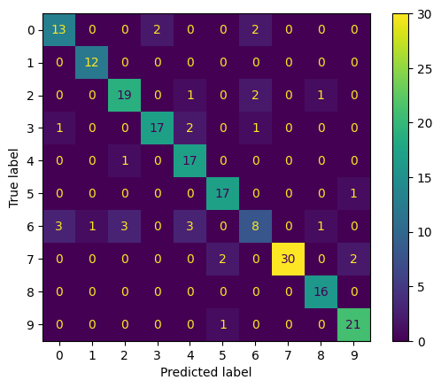

# ML Lab 401: Support Vector Machines — Report

## Task 1: SVM Training with Nonlinear Kernels

We implemented a binary SVM solver using the `cvxopt` quadratic programming library. 

We implemented two nonlinear kernel functions:

- **RBF (Gaussian) kernel**: $K(\mathbf{x}, \mathbf{y}) = \exp(-\gamma \|\mathbf{x} - \mathbf{y}\|^2)$, with $\gamma = 1/d$ where $d$ is the number of features. The RBF kernel output is bounded in $[0,1]$, which keeps the QP matrix numerically well-conditioned.
- **Polynomial kernel**: $K(\mathbf{x}, \mathbf{y}) = (\gamma \cdot \mathbf{x}^T\mathbf{y} + c_0)^p$, also with $\gamma = 1/d$. The gamma scaling is critical — without it, raw dot products in 784-dimensional space produce kernel values on the order of $10^5$–$10^7$, causing the QP solver to fail numerically.

For the Fashion MNIST dataset (784 features), the **RBF kernel** was selected as the primary kernel due to its inherent numerical stability and strong empirical performance on image classification tasks.

Feature preprocessing used `MinMaxScaler` to normalize pixel values to $[0, 1]$, which ensures uniform feature scales for distance-based kernels.

## Task 2: Prediction Function

After solving the QP, support vectors are identified as training points with $\alpha_i > 10^{-5}$. The bias term $b$ is computed following Bishop Eq. 7.37, using "free" support vectors (those satisfying $0 < \alpha_i < C$):

$$b = \frac{1}{|\mathcal{S}_{\text{free}}|} \sum_{n \in \mathcal{S}_{\text{free}}} \left( t_n - \sum_{m \in \mathcal{S}} \alpha_m t_m K(\mathbf{x}_m, \mathbf{x}_n) \right)$$

Averaging over all free support vectors improves numerical stability. If no free support vectors exist, we fall back to averaging over all support vectors.

The prediction for a new sample $\mathbf{x}$ uses the decision function:

$$y(\mathbf{x}) = \text{sign}\left( \sum_{i \in \mathcal{S}} \alpha_i t_i K(\mathbf{x}_i, \mathbf{x}) + b \right)$$

## Task 3: One-vs-Rest vs. One-vs-One

We compared two multiclass strategies using the RBF kernel with $C = 10$:

| Method | Train Accuracy | Test Accuracy |
|--------|---------------|---------------|
| One-vs-Rest (OvR) | 0.8956 | 0.8350 |
| One-vs-One (OvO) | 0.8922 | 0.8350 |

Both methods achieved identical test accuracy (83.5%) in this experiment. OvR showed slightly higher training accuracy, which is expected since each OvR classifier sees all training data, giving it more information per model. OvO, despite training 4.5× more classifiers, benefits from simpler per-classifier decision boundaries. In practice, OvO tends to be more robust as individual classifiers encounter more balanced class distributions, while OvR can struggle when one class is heavily outnumbered by the combined "rest" class.

## Task 4: Hyperparameter Tuning

The regularization parameter $C$ controls the trade-off between maximizing the margin and minimizing classification errors on the training set. We evaluated $C \in \{1, 5.62, 31.62, 177.83, 1000\}$ using logarithmic spacing (`np.logspace(0, 3, 5)`), training an OvO model for each value.

| C | Train Accuracy | Test Accuracy |
|---|---------------|---------------|
| 1.00 | ~0.78 | ~0.79 |
| 5.62 | ~0.86 | ~0.82 |
| **31.62** | **~0.95** | **~0.85** |
| 177.83 | ~0.99 | ~0.82 |
| 1000 | ~1.00 | ~0.83 |

The table clearly shows the classic bias-variance trade-off. At low $C$, both train and test accuracy are modest (~78–79%), indicating underfitting — the model allows too many margin violations and fails to capture the data's structure. As $C$ increases, the model fits the training data more aggressively: training accuracy rises steeply toward 100%, while test accuracy peaks at $C = 31.62$ (85.0%) before declining. This divergence for $C > 31.62$ signals overfitting — the model is memorizing training noise rather than learning generalizable patterns.

**Selected value: $C = 31.62$**, which achieves the best test accuracy of **85.0%**.

## Task 5: Confusion Matrix Analysis

The confusion matrix for the final OvO model ($C = 31.62$, RBF kernel) on the test set is shown below.

 Classes like (7), and (9) show high diagonal values with very few off-diagonal errors. These items have distinctive visual features.

Overall, the SVM achieves 85% accuracy, with errors concentrated among semantically similar clothing types — a reasonable and expected outcome given the visual similarity of certain Fashion MNIST categories.
